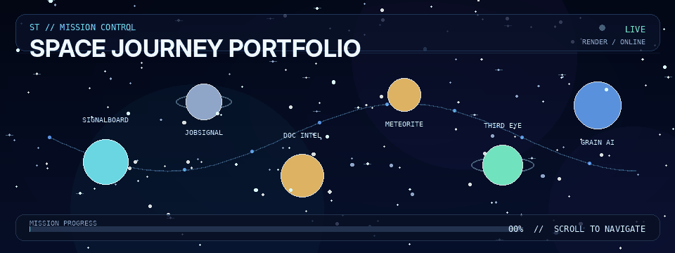
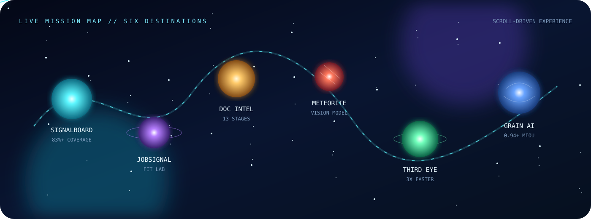
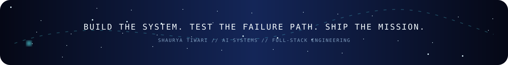

 

 

  

NOW PLAYING // SPACE JOURNEY PORTFOLIO

This is not a stack of ordinary project cards. It is a scroll-controlled cinematic mission where a spacecraft travels through six engineering worlds. Each destination represents a product, platform, workflow, or research system—with its own visual language, metrics, and mission brief.

Manual mode: scroll to pilot the craft.Auto Pilot: let the site play like a short interactive film.

  <a href="https://shaurya-portfolio-g1n0.onrender.com/">
    <strong>▶ START THE JOURNEY</strong>
  </a>

 

MISSION INDEX // SEASON 01

<table>
<tr>
<td width="50%" valign="top">

01 // SIGNALBOARD

Feedback intelligence station

Evidence-grounded synthesis where AI proposes, deterministic code proves, and humans make the final decision.

FastAPI PostgreSQL Playwright Docker

Telemetry: 20 tests · 83%+ coverage · 100% evidence coverage

Repository · Live product

</td>
<td width="50%" valign="top">

02 // JOBSIGNAL

Hiring-signal radar planet

An authenticated AI command centre for opportunity discovery, profile matching, résumé intelligence, and focused outreach.

Node.js Express Gemini Tavily JWT

Telemetry: email OTP · 7-day sessions · job-specific Fit Lab

Repository

</td>
</tr>
<tr>
<td width="50%" valign="top">

03 // DOCUMENT INTELLIGENCE

Multi-format archive moon

A production-minded ingestion-to-evaluation platform across text, spreadsheets, Office files, PDFs, and images.

Python ChromaDB BM25 RRF Pytest

Telemetry: 13 stages · 11 file types · 64 offline tests

</td>
<td width="50%" valign="top">

04 // METEORITE CLASSIFIER

Deep-space material scanner

A React and Flask application that classifies uploaded meteorite textures as metal-rich or silicate-rich.

React Vite Flask TensorFlow Keras

Telemetry: 224px input · 2 composition classes · prediction API

Repository

</td>
</tr>
<tr>
<td width="50%" valign="top">

05 // THIRD EYE

Procurement relay network

Tender discovery, document parsing, deterministic relevance validation, and tailored proposal generation in one workflow.

LangChain Llama 3 Streamlit SQLite

Telemetry: 3× faster · 0 observed crashes after redesign

</td>
<td width="50%" valign="top">

06 // GRAIN AI

Microscopy research world

M.Tech research fusing BSE microscopy with five EDS elemental maps for grain-scale segmentation.

PyTorch U-Net++ ResNet34 Mask R-CNN

Telemetry: 0.94+ mIoU · 95%+ accuracy · 18,996 grains

</td>
</tr>
</table>

SHIP SYSTEMS // WHAT MAKES IT DIFFERENT

PRE-FLIGHT       animated loading and launch sequence
NAVIGATION       scroll-controlled spacecraft + Auto Pilot
UNIVERSE         procedural starfield and velocity-based warp trails
DESTINATIONS     six custom project worlds with unique visual systems
MISSION BRIEFS   metrics, engineering decisions, repositories, live links
FLIGHT LOG       education, leadership, competitive programming
TRANSMISSION     clickable email, phone, LinkedIn, GitHub, and résumé
ACCESSIBILITY    responsive layout + reduced-motion support

No backend, database, API key, package installation, or paid runtime is required for the portfolio itself.

LIVE TELEMETRY // GITHUB SIGNAL

 

CONTRIBUTION ORBIT // SELF-UPDATING ANIMATION

<picture>
  <source media="(prefers-color-scheme: dark)" srcset="https://raw.githubusercontent.com/CyberXshaurya/Portfolio-Site/output/github-snake-dark.svg" />
  <source media="(prefers-color-scheme: light)" srcset="https://raw.githubusercontent.com/CyberXshaurya/Portfolio-Site/output/github-snake.svg" />
  
</picture>

The animation is regenerated automatically by .github/workflows/contribution-orbit.yml. After uploading the repository, open Actions → Generate contribution orbit → Run workflow once. It will then refresh every day.

FLIGHT DECK // RUN LOCALLY

git clone https://github.com/CyberXshaurya/Portfolio-Site.git
cd Portfolio-Site
python -m http.server 8080

Open:

http://localhost:8080

No npm install, build pipeline, token, or environment file is required.

DEPLOYMENT BAY // RENDER

The repository already contains render.yaml.

Service type       Static Site
Branch             main
Build command      echo "Static portfolio ready"
Publish directory  .
Environment vars   none
Start command      none

Every push to main triggers a new deployment on the connected Render site.

CONTROL DECK // UPDATE WITHOUT BREAKING THE UNIVERSE

Most editable content lives in one place:

assets/content.js

Module

Controls

profile

Role, introduction, availability, contact and social links

proofPoints

Launch-screen metrics

projects

Destinations, descriptions, tags, metrics, repositories and live URLs

capabilities

About-section strengths

stack

Payload and technology modules

timeline

Education and leadership flight log

achievements

Competitive programming and measured outcomes

Space artwork, project world rendering, the spacecraft, starfield, and Auto Pilot logic live in:

assets/app.js
assets/styles.css

Replace ShauryaCV.pdf with a newer PDF using the same filename to update every résumé link automatically.

REPOSITORY MAP

Portfolio-Site/
│
├── index.html
├── ShauryaCV.pdf
├── render.yaml
├── robots.txt
│
├── assets/
│   ├── content.js          # editable portfolio data
│   ├── app.js              # universe, spacecraft, Auto Pilot, interactions
│   ├── styles.css          # responsive cinematic interface
│   └── favicon.svg
│
├── readme-assets/
│   ├── mission-control.gif # animated README trailer
│   ├── mission-map.svg     # animated project orbit map
│   └── deep-space-footer.svg
│
└── .github/workflows/
    └── contribution-orbit.yml

CAPTAIN // CONTACT

AI/ML Systems · Full-Stack Engineering · Applied ML Research

  

<a href="https://shaurya-portfolio-g1n0.onrender.com/"><strong>OPEN THE LIVE SPACE JOURNEY ↗</strong></a>

 

